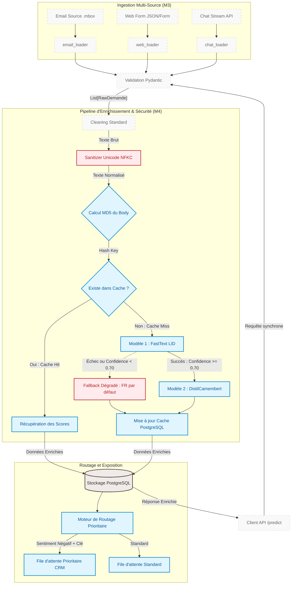

# Architecture Cible — Pipeline d'Enrichissement FastIA

Ce document décrit l'architecture technique cible permettant d'intégrer la détection de langue (FastText), l'analyse de sentiment (DistilCamembert), le système de mise en cache et le routage prioritaire au sein de la pipeline FastIA.

---

## 1. Diagramme d'Architecture (Mermaid)

Le diagramme suivant illustre le flux de données de l'ingestion multi-source jusqu'à l'exposition API et au stockage. Les composants existants (Module 3) sont représentés en gris, tandis que les nouveaux composants d'enrichissement, de cache et de sécurité sont mis en évidence par des couleurs spécifiques.

## 2. Registre et Cartographie des Composants

Le tableau suivant détaille la responsabilité de chaque brique logicielle, ses structures de données entrantes et sortantes, ainsi que son statut d'implémentation.

| Composant | Statut | Responsabilité principale | Format d'Entrée | Format de Sortie |
| :--- | :--- | :--- | :--- | :--- |
| **email_loader** | Existant (M3) | Ingestion des fichiers de messagerie `.mbox` et extraction des métadonnées brutes. | Fichier physique `.mbox` | `List[RawDemande]` (champs bruts) |
| **web_loader** | Existant (M3) | Réception et parsing des payloads issus des formulaires de contact Web. | Requête HTTP POST (JSON) | `RawDemande` |
| **chat_loader** | Existant (M3) | Écoute et sérialisation des flux textuels du canal Chat synchrone. | Stream / Message brut | `RawDemande` |
| **Validation Pydantic** | Existant (M3) | Validation stricte des types de données et contraintes de surface (longueur, non-nullité). | `RawDemande` (dict) | Instance de modèle `Pydantic.BaseModel` |
| **Cleaning Standard** | Existant (M3) | Nettoyage de premier niveau (suppression des balises HTML, espaces superflus). | Objet validé Pydantic | Texte brut nettoyé |
| **Sanitizer Unicode** | À implémenter (M4) | Défense périmétrique : normalisation de forme NFKC pour neutraliser les attaques par homoglyphes (*Visual Mimicry*) et caractères invisibles. | Texte brut nettoyé | Texte pur normalisé Unicode |
| **Cache Manager** | À implémenter (M4) | Interception des requêtes par hashing MD5 du texte pour éviter les inférences redondantes (Éco-conception). | Clé de Hash (MD5 string) | **Hit:** `(lang, lang_conf, sentiment, sent_conf)`    **Miss:** Trigger cascade d'inférence |
| **enrich_language** | À implémenter (M4) | Détection ultra-rapide de la langue du message via le modèle FastText (`lid.176.bin`). | Texte pur normalisé | `Tuple(lang: str, confidence: float)` |
| **enrich_sentiment** | À implémenter (M4) | Analyse fine du sentiment en français via le modèle transformeur distillé DistilCamembert. | Texte pur normalisé | `Tuple(sentiment: str, confidence: float)` |
| **Fallback Handler** | À implémenter (M4) | Sécurisation de la pipeline si `confidence < 0.70` ou crash modèle : affectation de valeurs par défaut pour éviter le blocage. | Erreur système ou score faible | `lang="fr"`, `lang_conf=0.0`, `sentiment="neutral"`, `sent_conf=0.0` |
| **PostgreSQL Storage** | Modifié (M4) | Persistance des données d'origine et des nouvelles dimensions d'enrichissement (ajouts de colonnes indexées). | Données d'origine + Métadonnées IA | Enregistrement physique en BDD |
| **Priority Router** | À implémenter (M4) | Algorithme de tri aiguillant les demandes vers la file d'attente appropriée selon le canal et la criticité du sentiment. | Ligne BDD enrichie | Affectation de file (`PriorityQueue` vs `StandardQueue`) |

## 3. Description des Mécanismes Clés

### A. Le Cycle du Cache d'Enrichissement
Afin de minimiser l'empreinte carbone et d'économiser les cycles CPU/GPU (notamment pour le modèle transformeur `DistilCamembert`), un mécanisme de mise en cache est positionné en amont de l'inférence :

1. Une empreinte unique (**Hash MD5**) est générée à partir du corps du texte normalisé.
2. Une vérification est faite en base de données.
3. **Cache Hit** : Les scores existants sont retournés immédiatement, la latence est de `< 1 ms`.
4. **Cache Miss** : Le texte est envoyé aux modèles, et les résultats d'inférence viennent alimenter le cache pour les futures requêtes identiques.

### B. Stratégie de Fallback et Robustesse
Conformément au *Threat Model*, si le modèle de langue échoue ou exprime une incertitude majeure (score de confiance `< 0.70`), la pipeline n'interrompt pas son exécution. Le **Fallback Handler** prend le relais :

* La langue est positionnée arbitrairement sur `"fr"` (le marché principal) avec une confiance de `0.0`.
* Le traitement passe directement à l'analyse de sentiment ou est marqué pour une révision humaine sans lever d'exception bloquante (`500 Internal Server Error`).

### C. Logique du Routage Prioritaire
Dès la persistance en base de données, le **Priority Router** applique la règle métier suivante :

* **Priorité absolue** : Si un message provient du canal **Chat** (besoin d'immédiateté) **ET** que son sentiment est évalué comme **Négatif** avec une confiance `> 0.70`, il est poussé immédiatement dans la file d'attente des agents.
* **Priorité secondaire** : Les emails au sentiment négatif suivent ce canal.
* **Flux classique** : Les messages aux sentiments positifs ou neutres intègrent le flux standard.