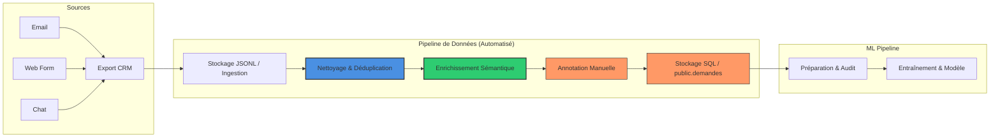

## 1. Chaîne d'approvisionnement actuelle
Les données proviennent de trois canaux d'entrée principaux simulés pour représenter l'activité de l'entreprise exemple :

* **Email :** Requêtes non structurées.
* **Formulaire Web :** Données semi-structurées via le site institutionnel (catégories pré-remplies par l'utilisateur).
* **Chatbot :** Requêtes courtes et directes.

**Processus de conversion :** Les messages ont été exportés depuis l'outil CRM client, puis convertis en format **JSONL (JSON Lines)** via un script Python. 

## 2. Cycle de vie mis à jour
1. **Ingestion :** Extraction brute des messages clients du CRM.
2. **Nettoyage & Déduplication Multi-Sources (Automatisée) :** Standardisation sémantique du texte (`input_text` débarrassé des balises HTML et bruits) et traitement des messages entrants pour identifier les doublons cross-canal à l'aide d'une empreinte sémantique.
3. **Enrichissement Sémantique (Automatisé — Évolution Brief 3) :** Inférence en temps réel via des modèles NLP locaux pour ajouter les variables analytiques et de routage (`langue`, `langue_confidence`, `sentiment`, `sentiment_score`) sur le texte nettoyé.
4. **Annotation (Manuelle) :** Un expert métier ajoute les colonnes `categorie`, `priorite` et rédige la `reponse_suggeree` sur les données qualifiées.
5. **Stockage :** Base de données SQL (table `public.demandes`) enrichie de ces dimensions et fichiers d'export pour l'analytique et l'historisation.
6. **Préparation :** Vérification de la structure et isolation des échantillons pour le pipeline ML.

## 3. Schéma du flux
Voici la représentation visuelle du parcours de la donnée incluant les briques de déduplication et d'enrichissement sémantique :

## 4. Stratégie de Déduplication et Points de Vigilance

Pour éviter les biais lors de l'entraînement sans perdre l'historique métier, une brique de déduplication intelligente a été mise en place :

### Nouvelles propriétés de données introduites
* `canal_metadata->>'semantic_hash'` : Empreinte MD5 calculée sur les 300 premiers caractères du message normalisé (nettoyé de sa ponctuation et passé en minuscules) afin de repérer les textes similaires.
* `dedup_status` : Statut d'intégrité de la ligne. Les valeurs possibles sont :
  * `"active"` : Message unique ou premier de sa série, éligible pour l'entraînement ML.
  * `"cross_channel_duplicate"` : Doublon sémantique envoyé via un autre canal dans la fenêtre critique.

### Points de vigilance clés
* **Approche non-destructive :** Supprimer les doublons cross-canal fausserait l'analyse produit. Savoir qu'un utilisateur a utilisé le chat $2\text{h}$ après un e-mail est un signal d'urgence capital. Conserver la ligne avec le statut `cross_channel_duplicate` permet d'isoler l'échantillon pour le pipeline IA (éviter le surapprentissage) tout en gardant l'historique complet pour l'analytique métier.
* **La limite du Chat Anonyme :** Si un log de chat ne contient pas d'adresse e-mail dans le champ `sender`, l'algorithme refuse la déduplication croisée avec d'autres sessions anonymes afin d'éviter d'assimiler par erreur tous les visiteurs inconnus à une seule et même entité.
* **Optimisation des requêtes SQL (Scale) :** Pour garantir la stabilité face au passage à l'échelle, la recherche de doublons s'effectue sur une fenêtre temporelle optimisée restreinte à $48$ heures en amont du lot entrant (`received_at >= current_time - 48h`), évitant ainsi de scanner inutilement des millions de lignes potentielles.

### 5. Stratégie d'Enrichissement Sémantique (Nouveauté Brief 3)

Pour répondre aux besoins d'escalade internationale et de détection de l'insatisfaction client, la pipeline intègre un bloc d'enrichissement positionné immédiatement après le nettoyage de texte :

#### Propriétés de données introduites par l'enrichissement
* **`langue` :** Code ISO de la langue détectée (`fr`, `en`, `es`).
* **`langue_confidence` :** Score de confiance de la prédiction statistique (ex: modèle *FastText*).
* **`sentiment` :** Qualification de l'état émotionnel de l'utilisateur (`Mécontent`, `Neutre/Satisfait`).
* **`sentiment_score` :** Score de probabilité associé à la classification de sentiment (ex: modèle *DistilCamembert*).

#### Justification de l'ordonnancement (Post-Cleaning / Pre-Stockage)
1. **Performance des Modèles NLP :** Les modèles de détection de langue et d'analyse de sentiment s'avèrent hautement sensibles aux artefacts textuels (balises HTML, sauts de lignes répétés, caractères spéciaux CRM). L'exécution en *post-cleaning* maximise la précision et la robustesse de l'inférence.
2. **Amont Décisionnel :** Le calcul de ces métriques doit obligatoirement précéder le stockage et le moteur de routage afin de permettre une sur-priorisation ou une distribution immédiate et déterministe lors de l'écriture finale en base de données.