# Plan de Mise en Œuvre Phasé — Pipeline d'Enrichissement FastIA

Ce document dresse la feuille de route (Roadmap) technique et opérationnelle pour le déploiement des fonctionnalités d'enrichissement IA de la pipeline FastIA. Afin de minimiser les risques de régression en production, le déploiement est découpé en 3 phases incrémentales, réparties sur **5 sprints de 2 semaines**.

---

## Vue d'Ensemble de la Roadmap

```mermaid
gantt
    title Feuille de route d'intégration FastIA (M4)
    dateFormat  X
    axisFormat Sprint %O
    
    section Phase 1 : Composant Langue
    Migration SQL & Sanity Checks       :1, 1
    Intégration FastText & /predict v2 :1, 2
    Script de Backfill Historique       :2, 2
    
    section Phase 2 : Composant Sentiment
    Intégration DistilCamembert (FR)    :3, 3
    Backfill Sentiment & Monitoring     :4, 4
    
    section Phase 3 : Routage Prioritaire
    Moteur de Routage & Endpoint /enrich :5, 5
    Dashboard Métier & Clôture          :5, 5
```



## Phase 1 — Composant Langue : Socle et Détection (2 Sprints)

### 1. Objectifs techniques
* Appliquer la structure de données cible.
* Déployer le modèle ultra-léger **FastText** pour étiqueter linguistiquement le flux entrant.
* Mettre à jour l'endpoint historique `/predict`.

### 2. Actions de la phase
* **Sprint 1** : Exécution de la migration Alembic (`xxx_add_enrichment_columns.py`) sur les environnements de staging puis de production. Intégration du module `src/security/input_sanitizer.py` et de la fonction `enrich_language()` dans le worker de nettoyage (`clean.py`).
* **Sprint 2** : Écriture et exécution du script de *Backfill* par lots (batchs de 500) pour enrichir rétroactivement les demandes existantes en base de données. Ajout des champs `langue` et `langue_confidence` au schéma Pydantic de réponse de `/predict`.

### 3. Fiche de livraison
* **Pré-requis** : Schéma SQL validé, fichiers binaires du modèle FastText (`lid.176.bin`) hébergés sur le stockage sécurisé de la CI/CD.
* **Livrables** : Script de migration appliqué, middleware de nettoyage actif, endpoint `/predict` enrichi, script de backfill exécuté.

#### Critères d'acceptation (DoD)
1. 100% des requêtes entrantes reçoivent un code **ISO-639-1** dans le payload de réponse.
2. La latence ajoutée sur `/predict` par la détection de langue est **inférieure à 0.5 ms** par document.
3. Le script de backfill a traité l'intégralité de l'historique sans générer d'erreurs d'intégrité en base.

#### Risques et atténuations
> **Risque (Élevé)** : Verrouillage accidentel de la table `demandes` pendant la migration.
> 
> **Atténuation** : Les colonnes sont configurées explicitement en `nullable=True` sans valeur par défaut immédiate pour éviter toute réécriture physique de la table.

---

## Phase 2 — Composant Sentiment : Analyse Fine (2 Sprints)

### 1. Objectifs techniques
* Déployer le modèle d'analyse de sentiment lourd (**DistilCamembert**) de manière éco-conçue en ciblant exclusivement le flux francophone.
* Monitorer le comportement thermique et l'usage RAM/CPU du modèle en conditions réelles.

### 2. Actions de la phase
* **Sprint 3** : Conditionnement de l'inférence : intégration du bloc `enrich_sentiment()` uniquement si `langue == 'fr'`. Pour les autres langues, affectation automatique de la valeur par défaut `neutral` (confiance `0.0`) afin de préserver les ressources de calcul.
* **Sprint 4** : Exécution du script de backfill pour l'analyse de sentiment sur l'historique français. Branchement des outils de monitoring (ex: Prometheus/Grafana) pour suivre la distribution des classes (positif, neutre, negatif) générées en production.

### 3. Fiche de livraison
* **Pré-requis** : Phase 1 finalisée en production, validation de l'allocation de mémoire RAM de l'instance de production (minimum **1.5 GB de RAM disponibles** pour charger DistilCamembert).
* **Livrables** : Pipeline de sentiment active en cascade, métriques de distribution exposées, historique mis à jour.

#### Critères d'acceptation (DoD)
1. Les messages non-FR sautent l'étape du modèle de sentiment (latence = **0 ms** pour eux).
2. La latence moyenne d'inférence pour les messages français reste **inférieure à 40 ms** (grâce à l'activation parallèle du cache d'enrichissement).

#### Risques et atténuations
> **Risque (Critique)** : Fuite de mémoire ou saturation CPU provoquant des timeouts sur l'API lors des pics de charge.
> 
> **Atténuation** : Activation du *Cache Manager* (hashing MD5 du texte). Si un utilisateur renvoie un message identique, le système lit directement la réponse en BDD sans solliciter le modèle.

---

## Phase 3 — Routage Prioritaire et Finitions (1 Sprint)

### 1. Objectifs techniques
* Activer l'intelligence métier de la pipeline en triant et orientant automatiquement les demandes selon leur criticité.
* Fournir aux équipes support et au CTO des interfaces de pilotage.

### 2. Actions de la phase
* **Sprint 5** : Implémentation de la structure conditionnelle du `Priority Router` :
```json
if langue != 'fr':
    routed_priority = "high_intl"
elif sentiment == "negatif" and sentiment_score > 0.80:
    routed_priority = "high_negative"
else:
    routed_priority = "normal"
```
Déploiement de l'endpoint d'analyse isolée POST /enrich. Création de vues SQL agrégées pour alimenter un dashboard de suivi des volumes de tickets par file d'attente.

### 3. Fiche de livraison
* **Pré-requis** : Phases 1 et 2 stables, connecteurs du CRM prêts à consommer le champ `routed_priority`.
* **Livrables** : Module `Priority Router`, endpoints `/enrich` et `/models` opérationnels, Dashboard de volumétrie.

#### Critères d'acceptation (DoD)
1. La colonne `routed_priority` est correctement documentée et systématiquement peuplée en base de données pour chaque nouvelle demande.
2. L'endpoint de diagnostic `/models/{task}/metrics` renvoie les scores exacts du benchmark.

#### Risques et atténuations
> **Risque (Moyen)** : Famine de la file d'attente normale si le volume de tickets prioritaires (`high_negative`) s'envole.
> 
> **Atténuation** : Implémentation du mécanisme de *Timeout de sécurité* documenté dans l'analyse éthique (rehaussement automatique de la priorité d'un ticket standard après un délai fixé).